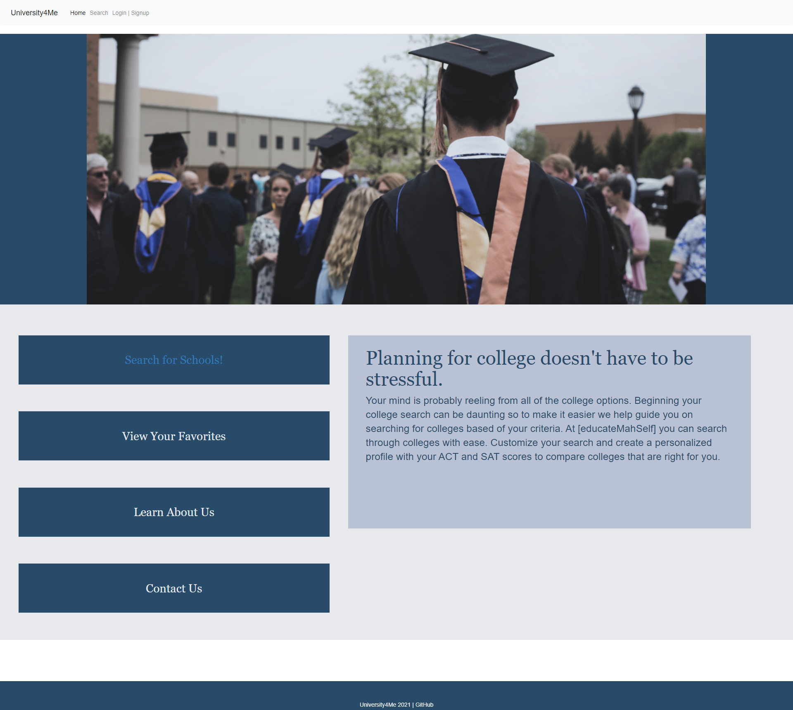
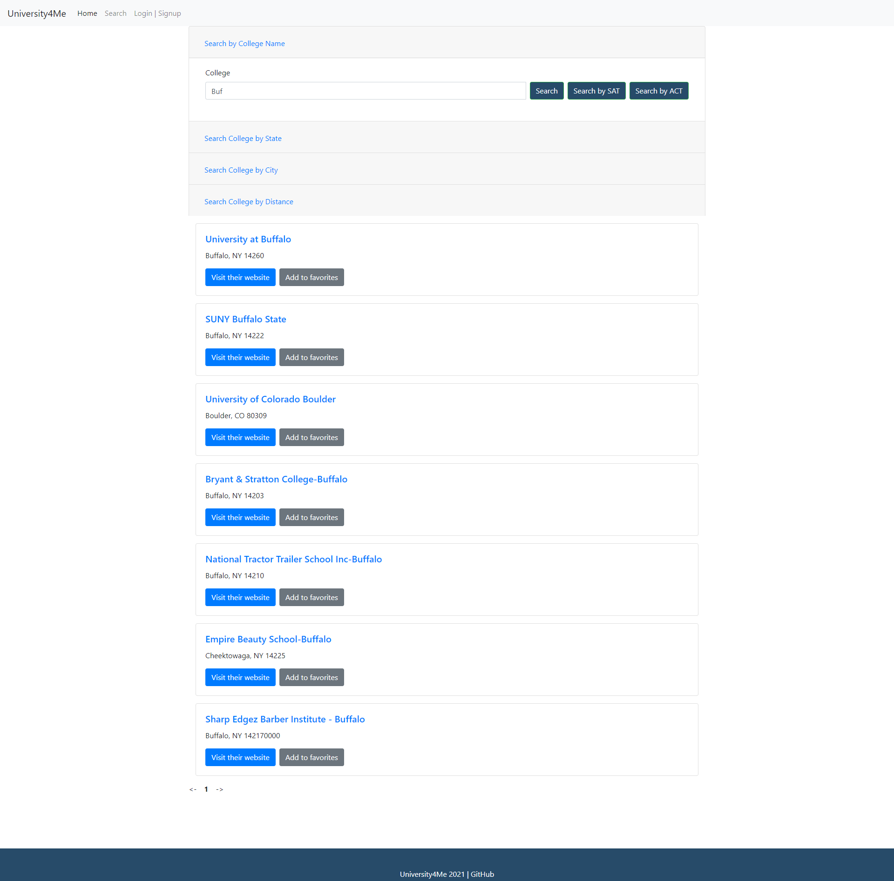
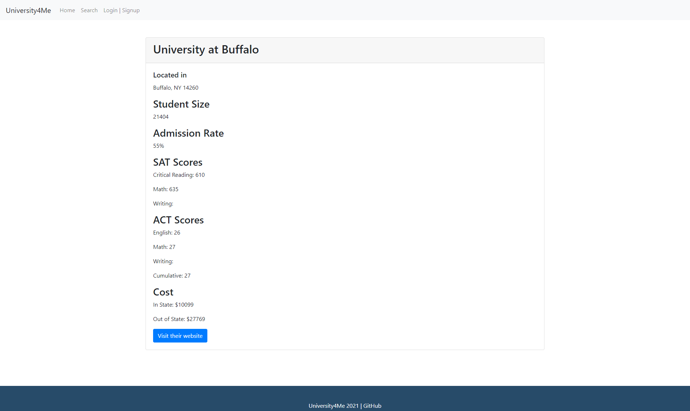

# University4Me

This project was bootstrapped with [Create React App](https://github.com/facebook/create-react-app).

## About
University4Me is a site designed to make searching for a college the user can go to easier. The user can search for all colleges in the US and the outlying territories based on the school's name, the state or territory, a city name, or by a certain distance from a zip code. The user can also click on a college name to view the school's student size, acceptance rate, the midpoint of SAT and ACT scores they school accepts, and tuition cost. The user will also be able to visit the school's website. 

## Deployed Site
The deployed site can be found here:
[University4Me](https://agile-thicket-84742.herokuapp.com/)